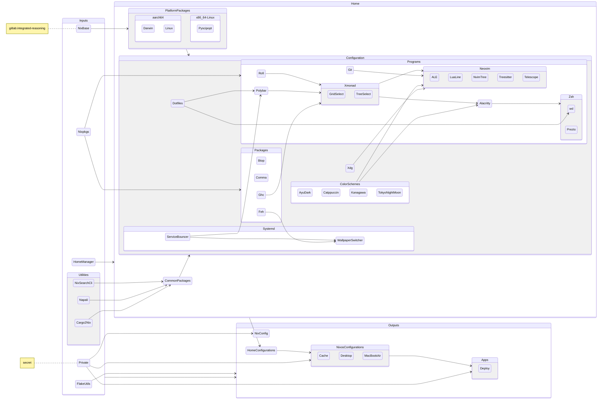

<!-- markdownlint-disable-next-line -->
<div align="center">

# nixos-config

Cross-platform NixOS + Home Manager configs


| **Shell** | **DM** | **WM** | **Editor** | **Terminal** | **Status Bar** | **Launcher** |
|-----------|--------|--------|------------|--------------|--------------|----------------|
| [Zsh+Prezto](https://github.com/sorin-ionescu/prezto) | [Xfce](https://www.xfce.org/) | [Xmonad](https://github.com/xmonad/xmonad) | [Neovim](https://github.com/neovim/neovim) | [Alacritty](https://github.com/alacritty/alacritty ) | [Polybar](https://github.com/polybar/polybar) | [Rofi](https://github.com/davatorium/rofi) |




---

</div>


## Features

Notable features (some of which live within private flakes but are illustrated below) include...

### Private Flakes

This flake makes use of private inputs to encapsulate sensitive configuration outside of the public repository.

Flakes provide a mechanism for securely referencing private Git repositories using a SSH URL. The private flake can then expose declarative and reusable bits of code without publishing sensitive details.

For example, private flakes can be used to store:

- Hardware details
- Closed-source software
- Local network information

Nix makes it easy to [merge attribute sets](https://nixos.org/manual/nix/unstable/language/operators.html#update) from public and private sources:
```nix
inputs = {
  private.url = "git+ssh://git@github.com/user/private-repository";
};

outputs = { self, nixpkgs, home-manager, private }: {

  nixConfig = {
    extra-substituters = [ ];
  } // private.nixConfig;

  # Merges in extra-substituters from private.nixConfig:
  # extra-substituters = [ "https://your-cache-address" ];
};
```

### 147 Virtual Desktops 🤯

[Xmonad](https://en.wikipedia.org/wiki/Xmonad) enables an unparalleled desktop management experience across multiple displays. [TreeSelect](https://hackage.haskell.org/package/xmonad-contrib-0.17.1/docs/XMonad-Actions-TreeSelect.html) and [GridSelect](https://hackage.haskell.org/package/xmonad-contrib-0.17.1/docs/XMonad-Actions-GridSelect.html) makes navigating this seemingly infinite canvas surprisingly natural and efficient.


### Local Nix Cache

Enable a local binary cache to improve build speeds by storing binaries locally after the first compilation. Uses nix-serve for caching and nginx as a reverse proxy:

```nix
services.nix-serve = {
  enable = true;
  secretKeyFile = "/path/to/key.pem";
};
services.nginx = {
  enable = true;
  recommendedProxySettings = true;
  virtualHosts = {
    "_" = {
      # Bind nginx to all available network interfaces:
      locations = {
        "/".proxyPass = "http://${config.services.nix-serve.bindAddress}" +
          ":${toString config.services.nix-serve.port}";
      };
    };
  };
};
```

### BTRFS + bees

The Nix package manager produces immutable build artifacts that remain in the Nix store until removal via garbage collection. Enabling the [Best-Effort Extent-Same (bees)](https://github.com/Zygo/bees) service on [BTRFS](https://btrfs.readthedocs.io/en/latest/Introduction.html) helps reclaim space by continuously performing block-level deduplication in the background. 

BTRFS also provides transparent compression and instant copy-on-write [snapshots](https://btrfs.readthedocs.io/en/latest/Subvolumes.html). On a NixOS system with 100s of generations of packages, enabling BTRFS + bees saves a considerable amount of space:

```nix
services.beesd = {
  filesystems = {
    root = {
      # Filesystem to run bees dedupe on (can also be a path):
      spec = "LABEL=nixos";

      # 4 GB hash table size
      hashTableSizeMB = 4096;

      # This caches block fingerprints to check newly
      # written blocks against existing. Too small and
      # dedupe rates suffer. Too large just wastes RAM.

      # unique data size |  hash table size |average dedupe extent size
      #     1TB          |      4GB         |        4K
      #     1TB          |      1GB         |       16K
      #     1TB          |    256MB         |       64K
      #     1TB          |    128MB         |      128K
      #     1TB          |     16MB         |     1024K
      #    64TB          |      1GB         |     1024K
      # Source: https://github.com/Zygo/bees/blob/master/docs/config.md

      verbosity = "info";
      extraOptions = [
        # Max load avg target before throttling:
        "--loadavg-target" "4.0"
        # Number of worker threads to use:
        "--thread-count" "4"
      ];
    };
  };
};

```

### Bonded Network Interfaces

Nix cache servers generate heavy network activity distributing build artifacts between machines. Bonding multiple physical NICs can provide better throughput and reliability for handling this traffic.

This example bonds two individual gigabit interfaces into a single logical interface using the Linux bonding driver:

```nix
systemd.network = {
  enable = true; # Enable systemd network management
  netdevs = {
    "10-bond0" = {
      netdevConfig = {
        Kind = "bond"; # Create a bond device
        Name = "bond0"; # Name it bond0
      };
      bondConfig = {
        Mode = "802.3ad"; # Aggregate bandwith with 802.3ad
        TransmitHashPolicy = "layer3+4"; # Distribute packets across links
      };
    };
  };
  networks = {
    "30-enp1s0" = {
      matchConfig.Name = "enp1s0"; # Match NIC 1
      networkConfig.Bond = "bond0"; # Assign it to bond0
    };

    "30-eno2" = {
      matchConfig.Name = "eno2"; # Match NIC 2
      networkConfig.Bond = "bond0"; # Assign it to bond0
    };
    "40-bond0" = {
      matchConfig.Name = "bond0"; # Match bond0
      linkConfig = {
        # Ensure bond0 only activates when carrier detected:
        RequiredForOnline = "carrier"; # Wait for links
      };
      networkConfig = {
        # Disable automatic link-local IPv6 address assignment.
        # Having multiple fe80::/10 addresses, one per bonded link,
        # creates clutter and inconsistencies. Since routable global
        # IPv6 addresses are also configured, just relying on those
        # without link-local for simplicity and consistency across
        # the aggregated bond interface.
        LinkLocalAddressing = "no"; # Disable IPv6 link-local
      };
    };
  };
};
```

### CCache

Compile times for C++ projects can be dramatically improved using [CCache](https://github.com/ccache/ccache):

```nix
programs.ccache.enable = true;
nix.settings.extra-sandbox-paths = [
  config.programs.ccache.cacheDir
];
```

CCache introduces non-determinism that can result in mismatching build output hashes. **Use with care.**


### Apple Function Key Remap

Some Apple keyboards have the function key placed in what should be the location of the control key. Fortunately there's a simple fix:

```nix
boot.kernelModules = [ "hid_apple" ];
boot.kernelParams = [
  "hid_apple.swap_fn_leftctrl=1"
];
```

### Borg Backup

[BorgBackup](https://borgbackup.readthedocs.io/en/stable/) enables encrypted disk-based snapshots to any remote SSH storage:

```nix
services.borgbackup.jobs.your-server = {
  # Files and directories to backup:
  paths = [
    "/home"
    "/etc"
  ];

  # Encrypt archives client-side before uploading:
  encryption.mode = "repokey";

  # Borg repository path on storage host:
  repo = "ssh://user@backuphost/backups";

  # Compress archives using LZMA:
  compression = "auto,lzma";

  # Run a backup daily
  startAt = "daily";
};
```

Borg manages incremental changes at the block level to maximize space savings and transfer efficiency. It verifies integrity end-to-end with hashes against silent corruption.


### Declarative Deployments

The private portion of this config utilizes [Nixinate](https://github.com/MatthewCroughan/nixinate) to enable declarative deployment of NixOS machines.

Nixinate generates a deployment script for each `nixosConfiguration`:

```nix
apps = nixinate.nixinate.x86_64-linux self;
nixosConfigurations = {
  "nixos-cache" = nixpkgs.lib.nixosSystem {
    system = "x86_64-linux";
    modules = [
      ./nixos/cache/configuration.nix
      ./nixos/cache/hardware-configuration.nix
      {
        _module.args.nixinate = {
          host = "your-cache-address";
          sshUser = "nixuser";
          buildOn = "remote"; # or "local"
          hermetic = true; # if false, use remote's Nix
          substituteOnTarget = true;
        };
      }
    ];
  };
};
```

Changes can then be deployed with:

```bash
nix run .#apps.nixinate.nixos-cache
```
