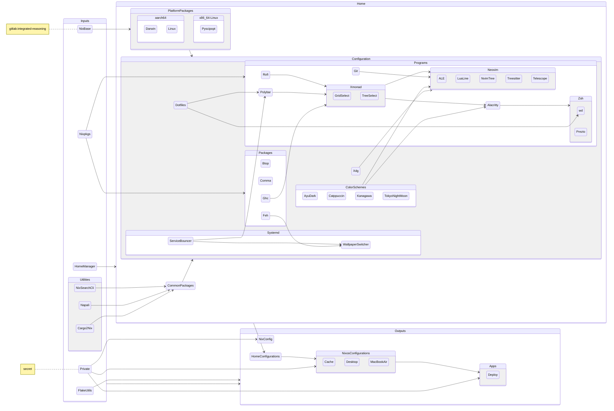

# nixos-config

Cross-platform NixOS + Home Manager configs


| **Shell** | **DM** | **WM** | **Editor** | **Terminal** | **Status Bar** | **Launcher** |
|-----------|--------|--------|------------|--------------|--------------|----------------|
| [Zsh+Prezto](https://github.com/sorin-ionescu/prezto) | [Xfce](https://www.xfce.org/) | [Xmonad](https://github.com/xmonad/xmonad) | [Neovim](https://github.com/neovim/neovim) | [Alacritty](https://github.com/alacritty/alacritty ) | [Polybar](https://github.com/polybar/polybar) | [Rofi](https://github.com/davatorium/rofi) |


```mermaid
stateDiagram-v2
  direction LR
  state Inputs {
    state Utilities {
      Cargo2Nix
      NixSearchCli
      Napali
      Cargo2Nix --> CommonPackages
      Napali --> CommonPackages
      NixSearchCli --> CommonPackages
    }
    NixBase
    NixBase --> PlatformPackages
    note left of NixBase
      gitlab:integrated-reasoning
    end note
    Private
    Private --> Apps
    Private --> NixConfig
    Private --> NixosConfigurations
    note left of Private
      secret
    end note
    FlakeUtils
    HomeManager
    Nixpkgs
    Nixpkgs --> Packages
    Nixpkgs --> Programs
  }
  HomeManager --> Home
  state Home {
    CommonPackages
    state PlatformPackages {
      state aarch64 {
        Darwin
        Linux
      }
      state x86_64-Linux{
        Pyscipopt
      }
    }
    CommonPackages --> Configuration
    PlatformPackages --> Configuration
    state Configuration {
      Dotfiles
      Dotfiles --> Polybar
      ServiceBouncer --> Polybar
      Dotfiles --> wd
      state Packages {
        Btop
        Comma
        Feh
        Feh --> WallpaperSwitcher
        Ghc
        Ghc --> Xmonad
        Polybar
      }
      Xdg
      Xdg --> Neovim
      state ColorSchemes {
        AyuDark
        Catppuccin
        Kanagawa
        TokyoNightMoon
      }
      ColorSchemes --> Alacritty
      ColorSchemes --> Neovim
      state Programs {
        Alacritty
        Git
        Git --> Neovim
        state Neovim {
          ALE
          LuaLine
          NvimTree
          Treesitter
          Telescope
        }
        Polybar --> Xmonad
        state Xmonad {
          GridSelect
          TreeSelect
        }
        state Zsh {
          Prezto
          wd
        }
        Rofi
        Rofi --> Xmonad
        Xmonad --> Alacritty
        Xmonad --> Neovim
        Alacritty --> Zsh
      }
      state Systemd {
        WallpaperSwitcher
        ServiceBouncer
        ServiceBouncer --> WallpaperSwitcher
      }
    }
  }
  Inputs --> Outputs
  FlakeUtils --> Outputs
  Home --> HomeConfigurations
  state Outputs {
    HomeConfigurations
    HomeConfigurations --> NixosConfigurations
    state NixosConfigurations {
      Cache
      Desktop
      MacBookAir
    }
    NixConfig
    NixosConfigurations --> Apps
    state Apps {
      Deploy
    }
  }
```


---

## Features

Notable features (some of which live within private flakes but are illustrated below) include...

### ZFS Storage

The system uses [ZFS](https://openzfs.org/wiki/Main_Page) as its primary filesystem, configured with separate datasets for different parts of the system. ZFS provides advanced features like:

- Copy-on-write snapshots
- Built-in compression
- Data integrity verification
- L2ARC caching for improved performance

Example ZFS configuration:

```nix
{
  # Use latest kernel compatible with ZFS
  boot.kernelPackages = config.boot.zfs.package.latestCompatibleLinuxPackages;
  
  # Configure ZFS parameters
  boot.kernelParams = [
    "zfs.zfs_arc_max=137438953472"  # Set max ARC size (128GB)
  ];
  
  boot.supportedFilesystems = [ "zfs" ];
  
  # Enable ZFS support in bootloader
  boot.loader.grub = {
    enable = true;
    zfsSupport = true;
    efiSupport = true;
  };

  # Configure L2ARC parameters
  boot.extraModprobeConfig = ''
    options zfs l2arc_noprefetch=0 l2arc_write_boost=33554432 l2arc_write_max=16777216
  '';

  # Enable ZFS maintenance
  services.zfs = {
    autoScrub.enable = true;  # Regular data integrity checking
    trim.enable = true;       # SSD TRIM support
  };

  # Dataset configuration example
  fileSystems = {
    "/" = { device = "zpool/root"; fsType = "zfs"; };
    "/nix" = { device = "zpool/nix"; fsType = "zfs"; };
    "/home" = { device = "zpool/home"; fsType = "zfs"; };
    "/var" = { device = "zpool/var"; fsType = "zfs"; };
  };
}
```

The configuration includes integrated monitoring via Polybar, displaying ZFS pool status and usage metrics in real-time.

### BTRFS + bees (Historical)

While the system now uses ZFS, the following BTRFS configuration is preserved for reference as it provides an interesting alternative approach to filesystem deduplication:

The Nix package manager produces immutable build artifacts that remain in the Nix store until removal via garbage collection. Enabling the [Best-Effort Extent-Same (bees)](https://github.com/Zygo/bees) service on [BTRFS](https://btrfs.readthedocs.io/en/latest/Introduction.html) helps reclaim space by continuously performing block-level deduplication in the background. 

BTRFS also provides transparent compression and instant copy-on-write [snapshots](https://btrfs.readthedocs.io/en/latest/Subvolumes.html). On a NixOS system with 100s of generations of packages, enabling BTRFS + bees saves a considerable amount of space:

```nix
services.beesd = {
  filesystems = {
    root = {
      # Filesystem to run bees dedupe on (can also be a path):
      spec = "LABEL=nixos";

      # 4 GB hash table size
      hashTableSizeMB = 4096;

      # This caches block fingerprints to check newly
      # written blocks against existing. Too small and
      # dedupe rates suffer. Too large just wastes RAM.

      # unique data size |  hash table size |average dedupe extent size
      #     1TB          |      4GB         |        4K
      #     1TB          |      1GB         |       16K
      #     1TB          |    256MB         |       64K
      #     1TB          |    128MB         |      128K
      #     1TB          |     16MB         |     1024K
      #    64TB          |      1GB         |     1024K
      # Source: https://github.com/Zygo/bees/blob/master/docs/config.md

      verbosity = "info";
      extraOptions = [
        # Max load avg target before throttling:
        "--loadavg-target" "4.0"
        # Number of worker threads to use:
        "--thread-count" "4"
      ];
    };
  };
};

### Private Flakes

Private flakes contain sensitive configuration and are managed separately from the public configuration. These include:

- Personal credentials and API tokens
- Work-specific configurations
- Private package overrides
- System-specific secrets

The private flakes are referenced in the main configuration using flake inputs:

```nix
{
  inputs = {
    private = {
      url = "git+file:///path/to/private/flake";
      # or using ssh:
      # url = "git+ssh://git@github.com/username/private-flake.git";
    };
  };
  
  outputs = { self, nixpkgs, private, ... }: {
    # Merge configurations
    nixosConfigurations.hostname = nixpkgs.lib.nixosSystem {
      modules = [
        ./configuration.nix
        private.nixosModules.default
      ];
    };
  };
}
```

The private flake typically contains:

- Secret management using agenix
- Work-specific development environments
- Custom package overrides
- Machine-specific configurations

### 147 Virtual Desktops 🤯

[Xmonad](https://en.wikipedia.org/wiki/Xmonad) enables an unparalleled desktop management experience across multiple displays. [TreeSelect](https://hackage.haskell.org/package/xmonad-contrib-0.17.1/docs/XMonad-Actions-TreeSelect.html) and [GridSelect](https://hackage.haskell.org/package/xmonad-contrib-0.17.1/docs/XMonad-Actions-GridSelect.html) makes navigating this seemingly infinite canvas surprisingly natural and efficient.


### Local Nix Cache

Enable a local binary cache to improve build speeds by storing binaries locally after the first compilation. Uses nix-serve for caching and nginx as a reverse proxy:

```nix
services.nix-serve = {
  enable = true;
  secretKeyFile = "/path/to/key.pem";
};
services.nginx = {
  enable = true;
  recommendedProxySettings = true;
  virtualHosts = {
    "_" = {
      # Bind nginx to all available network interfaces:
      locations = {
        "/".proxyPass = "http://${config.services.nix-serve.bindAddress}" +
          ":${toString config.services.nix-serve.port}";
      };
    };
  };
};

### Bonded Network Interfaces

Network interface bonding combines multiple network interfaces into a single logical interface for increased throughput and redundancy:

```nix
{
  networking.bonds.bond0 = {
    interfaces = [ "enp5s0" "enp6s0" ];
    driverOptions = {
      mode = "802.3ad";        # IEEE 802.3ad LACP
      lacp_rate = "fast";
      xmit_hash_policy = "layer3+4";  # Better load distribution
      miimon = "100";          # Link monitoring interval
    };
  };

  # Configure the bonded interface
  networking.interfaces.bond0 = {
    useDHCP = false;
    ipv4.addresses = [{
      address = "192.168.1.2";
      prefixLength = 24;
    }];
  };
}
```

This configuration:
- Combines two physical interfaces (enp5s0 and enp6s0)
- Uses LACP (Link Aggregation Control Protocol)
- Monitors link status every 100ms
- Distributes traffic based on IP+port hashing

### CCache

CCache speeds up recompilation by caching previous compilations. This is particularly useful for large C/C++ projects:

```nix
{
  programs.ccache = {
    enable = true;
    packageNames = [ "linux" "firefox" "chromium" ];  # Packages to cache
    cacheDir = "/var/cache/ccache";
    maxSize = "50G";
  };

  # Environment setup
  environment.variables = {
    CCACHE_DIR = "/var/cache/ccache";
    CCACHE_MAXSIZE = "50G";
    # Use compression to store more objects
    CCACHE_COMPRESS = "1";
    # Share cache between different versions of compilers
    CCACHE_COMPILERCHECK = "content";
    # Include CPP directives in hash
    CCACHE_SLOPPINESS = "include_file_mtime";
  };
}
```

The configuration:
- Enables ccache for specific packages
- Sets a 50GB cache size limit
- Uses compression to optimize storage
- Shares cache between compiler versions
- Includes preprocessor directives in caching

### Apple Function Key Remap

Apple keyboards default to media keys, requiring the Fn key for F1-F12 functionality. This configuration reverses that behavior:

```nix
{
  # Enable custom keyboard configuration
  boot.extraModprobeConfig = ''
    options hid_apple fnmode=2 iso_layout=0 swap_opt_cmd=1
  '';

  # Create modprobe config file
  environment.etc."modprobe.d/hid_apple.conf".text = ''
    options hid_apple fnmode=2
    options hid_apple iso_layout=0
    options hid_apple swap_opt_cmd=1
  '';

  # Ensure module is loaded
  boot.kernelModules = [ "hid_apple" ];
}
```

Configuration details:
- fnmode=2: F1-F12 keys work without Fn key
- iso_layout=0: Use ANSI keyboard layout
- swap_opt_cmd=1: Swap Option and Command keys for better Linux compatibility

### Borg Backup

[Borg](https://www.borgbackup.org/) provides encrypted, compressed, and deduplicated backups:

```nix
{
  services.borgbackup.jobs.home = {
    paths = [ "/home" ];
    exclude = [
      "*.pyc"
      "*/node_modules"
      "*/.cache"
      "*/target"
    ];
    repo = "ssh://user@backup.example.com/./backups";
    encryption = {
      mode = "repokey-blake2";
      passCommand = "cat /run/secrets/borg-password";
    };
    environment.BORG_RSH = "ssh -i /run/secrets/backup-key";
    compression = "auto,lz4";
    startAt = "hourly";
    
    prune.keep = {
      within = "1d";   # Keep all archives from the last day
      daily = 7;       # Keep 7 daily archives
      weekly = 4;      # Keep 4 weekly archives
      monthly = 6;     # Keep 6 monthly archives
    };
  };
}
```

Features:
- Encrypted backups using blake2 checksums
- LZ4 compression for speed
- Hourly incremental backups
- Flexible retention policy
- SSH key authentication
- Exclusion patterns for cache directories

### Declarative Deployments

System deployments are automated using [deploy-rs](https://github.com/serokell/deploy-rs), enabling declarative multi-machine deployments:

```nix
{
  deploy.nodes = {
    machine1 = {
      hostname = "machine1.example.com";
      profiles.system = {
        sshUser = "root";
        path = deploy-rs.lib.x86_64-linux.activate.nixos
          self.nixosConfigurations.machine1;
        fastConnection = true;
      };
    };
    
    machine2 = {
      hostname = "machine2.example.com";
      profiles.system = {
        sshUser = "root";
        path = deploy-rs.lib.x86_64-linux.activate.nixos
          self.nixosConfigurations.machine2;
        magicRollback = true;
      };
    };
  };
}
```

Features:
- Atomic system upgrades
- Automatic rollback on failure
- SSH-based remote deployment
- Multiple machine profiles
- Parallel deployment support
- Health checks post-deployment