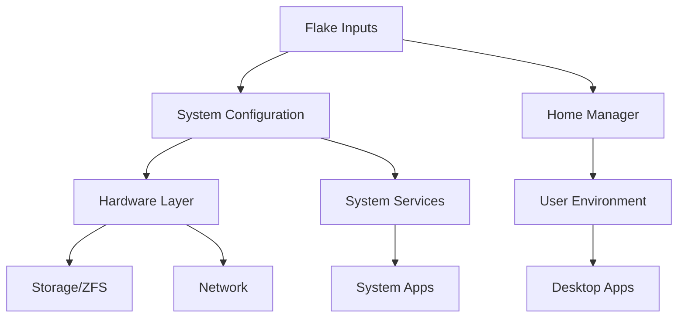
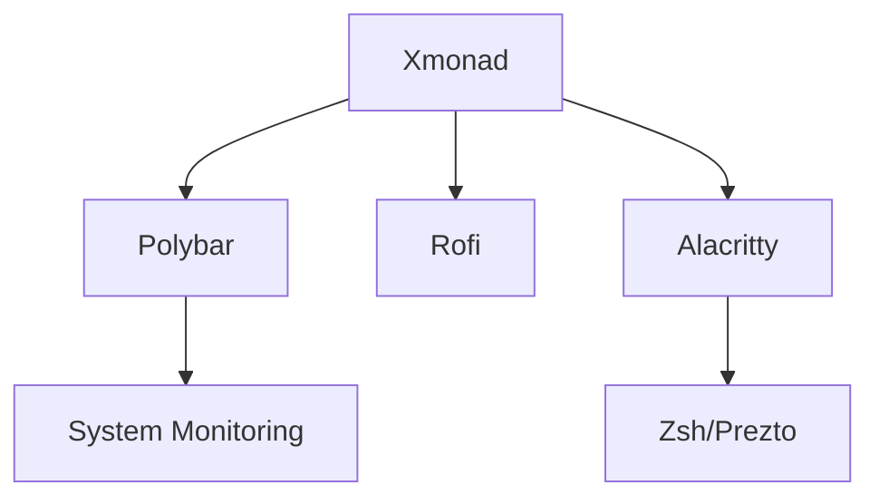

# System Architecture

This document outlines the high-level architecture of the NixOS configuration framework.

## Overview

The system implements a modular, flake-based configuration that separates concerns into distinct layers:



## Configuration Layers

### 1. Flake Layer

The entry point managing dependencies and configurations:

```nix
{
  inputs = {
    nixpkgs.url = "github:nixos/nixpkgs/nixos-unstable";
    home-manager.url = "github:nix-community/home-manager";
    private.url = "git+ssh://git@github.com/david-r-cox/private-nixos-config";
    # Additional inputs...
  };

  outputs = { self, nixpkgs, home-manager, private, ... }: {
    nixosConfigurations = {
      desktop = nixpkgs.lib.nixosSystem {
        # System configuration
      };
    };
  };
}
```

### 2. System Configuration

Core system settings and hardware configuration:

- Boot configuration
- Hardware enablement
- System services
- Network setup
- Storage configuration

### 3. Home Manager Layer

User environment configuration:

- Desktop environment (Xmonad)
- Development tools
- Application settings
- Shell configuration

## Component Integration

### Private Configuration

Sensitive configurations are managed through a private flake:

1. Hardware-specific details
2. Network configurations
3. Secure credentials
4. Machine-specific optimizations

### Desktop Environment

The desktop stack consists of:



### Development Environment

Optimized development setup with:

1. Neovim configuration
2. Language servers
3. Build tools
4. Version control

## Configuration Management

### Updates and Deployment

System updates follow this workflow:

1. Update flake inputs
2. Test changes locally
3. Commit updates
4. Deploy via `nixos-rebuild`

### Maintenance

Regular maintenance includes:

1. Garbage collection
2. Storage optimization
3. Cache management
4. Backup procedures

## Security Model

The system implements security through:

1. Private configuration separation
2. Secure boot configuration
3. Network security
4. Access controls

## Performance Optimization

System performance is optimized via:

1. ZFS tuning
2. Cache configuration
3. Service optimization
4. Resource management

## Future Architecture

Planned architectural improvements:

1. Container integration
2. Additional security hardening
3. Backup automation
4. Monitoring enhancements

## Development Guidelines

When extending the architecture:

1. Maintain modularity
2. Document changes
3. Test thoroughly
4. Follow NixOS best practices

## References

- [NixOS Manual](https://nixos.org/manual/nixos/stable/)
- [Home Manager Manual](https://nix-community.github.io/home-manager/)
- [Flakes Reference](https://nixos.wiki/wiki/Flakes)